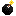
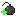

# ANDRES_PODEDWORNY_PYTHON_24
Bomberman game in python

|    | Piotr Andres                     | Paweł Podedworny                 | Status |
|----|----------------------------------|----------------------------------|--------|
| 3. | Postacie i poruszanie się        | Mapa, kolizje-ściany             | ✔      |
| 4. | Grafika / skórki                 | Mechanizm wybuchania skrzynek    | ✔      |
| 5. | Mechanizm zabijania / wygrywania | Modyfikatory / bonusy            | ✔    |
| 6. | Ustawienia                       | Menu główne                      | ❌      |
| 7. | Finalne poprawki                 | Finalne poprawki                 | ❌      |


## Link do plików 
```
https://drive.google.com/drive/folders/1gpzibEIw-xvMx7Xo9Rx57lgoypi_3oqx?usp=sharing
```

#### Players
   

You can choose 2, 3, or 4 players. Each player has their own set of keys on the keyboard.

- Player 1

`W` - move up  
`S` - move down  
`A` - move left  
`D` - move right  
`SPACE` - place bomb  
- Player 2

`Up arrow` - move up  
`Down arrow` - move down  
`Left arrow` - move left  
`Right arrow` - move right  
`RIGHT CTRL` - place bomb  
- Player 3

`I` - move up  
`K` - move down  
`J` - move left  
`L` - move right  
`RIGHT SHIFT` - place bomb  
- Player 4  

`NUM 8` - move up  
`NUM 5` - move down  
`NUM 4` - move left  
`NUM 6` - move right  
`NUM 0` - place bomb  
Each player starts with one bomb which can destroy boxes  and kill players.

#### Bombs
 

Every bomb explodes 3 seconds after being placed and destroys everything within a range of 2 possible fields. It is possible to extend the bomb's range through a special modifier.

#### Modifiers
In the menu, we can disable modifiers.

 extends bomb range by an extra 2 fields   
 gives an extra bomb   
 gives extra speed for 5 seconds

#### Map Type
In the menu, we can choose from 3 types of maps:

- Full: filled with boxes
- Empty: no boxes
- Random: the map is filled randomly. The filling of the map is random, ranging from 50% to 99%.
#### Extra Bomb from Box
A random extra bomb can appear from destroyed boxes, and we can set its chance between 1% and 10%.